# Database-MySQL-2
Ini adalah lanjutan dari Database-MySQL-1. Membuat database perpustakaan yang lebih lengkap dengan menambahkan fitur-fitur.

# Tugas 2 - Database Perpustakaan (Relasi & Bonus)

## 1. Struktur Tabel Buku
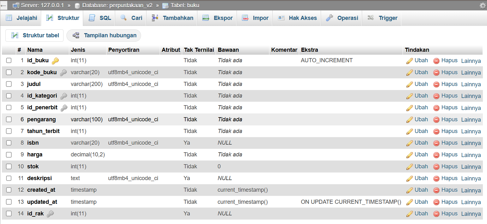

## 2. Struktur Tabel Kategori
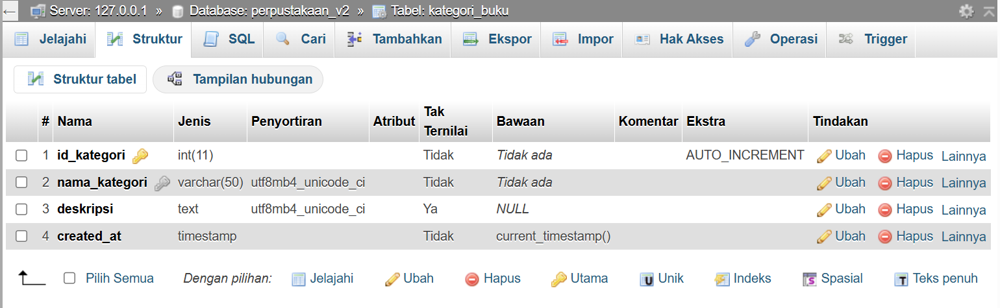

## 3. Struktur Tabel Penerbit
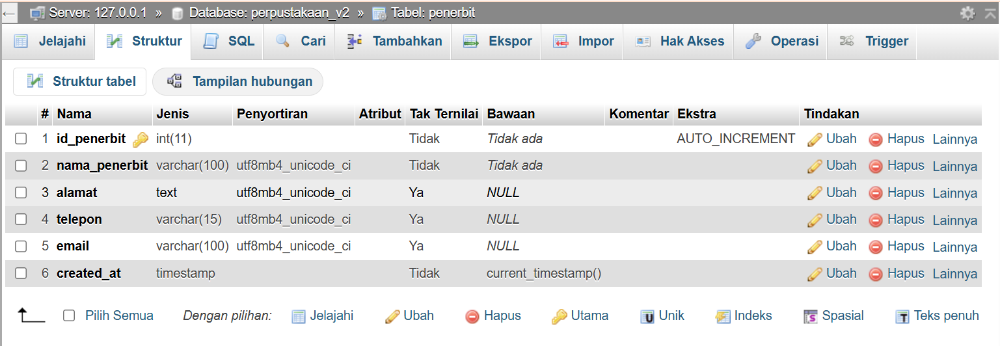

## 4. Struktur Tabel Rak
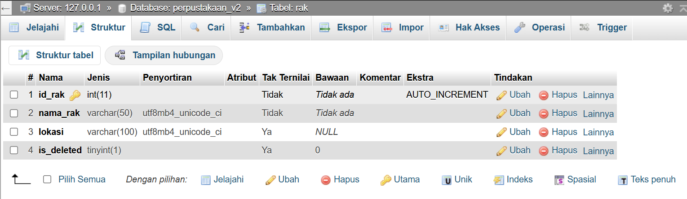

---

## 5. Data Tabel Buku
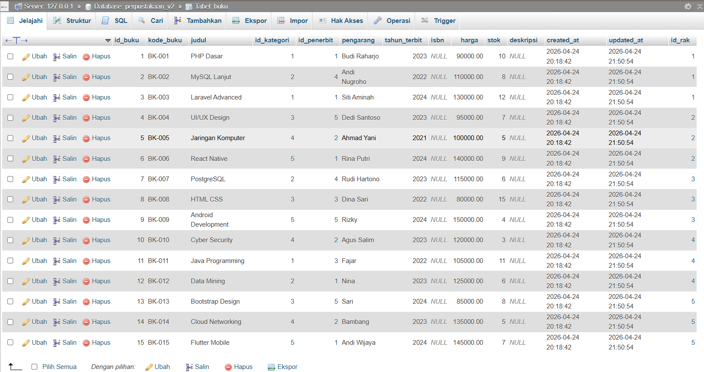

## 6. Data Tabel Kategori
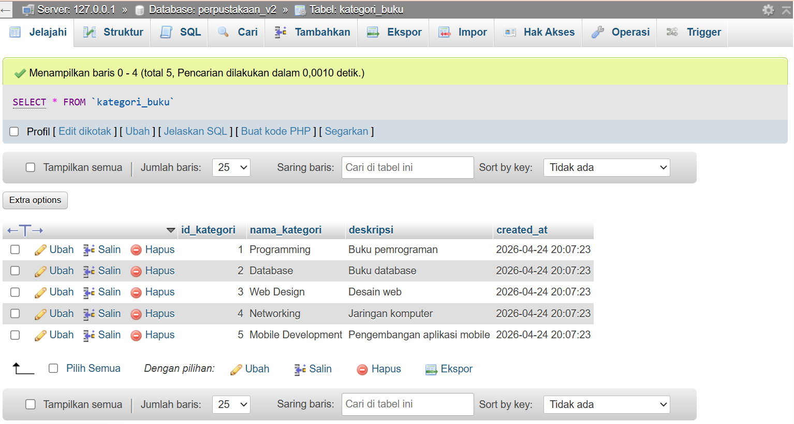

## 7. Data Tabel Penerbit
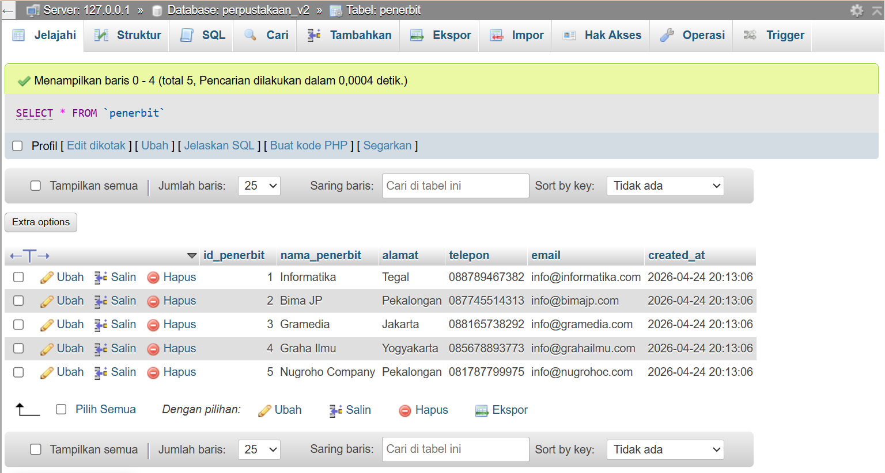

## 8. Data Tabel Rak
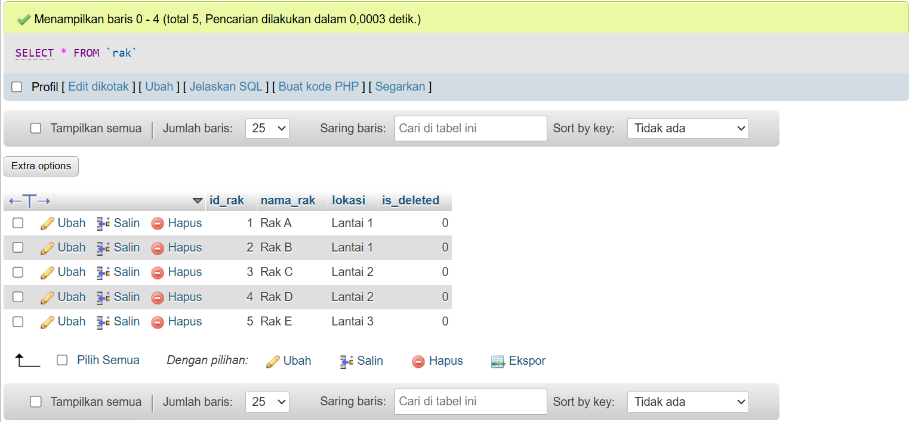

---

## 9. JOIN Buku dengan Kategori dan Penerbit
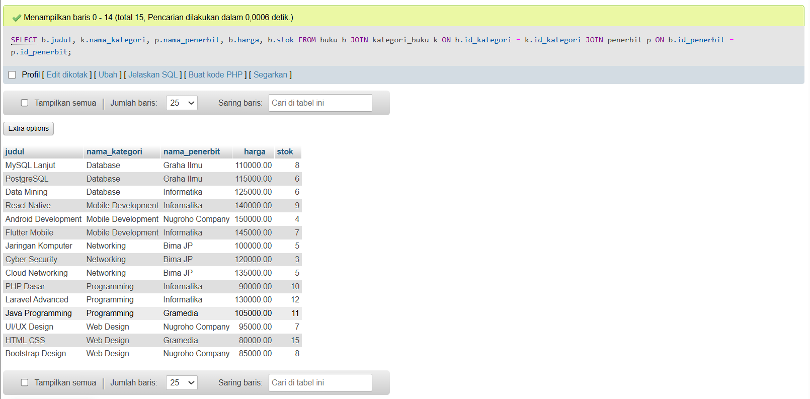

## 10. Jumlah Buku per Kategori
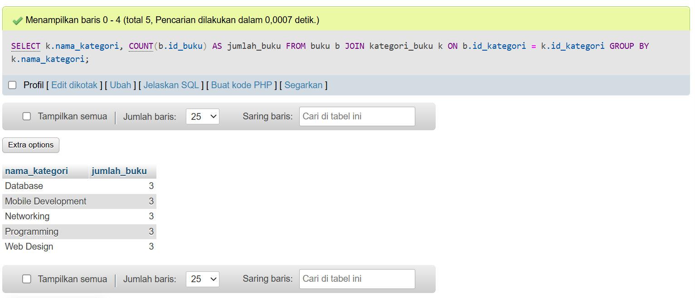

## 11. Jumlah Buku per Penerbit
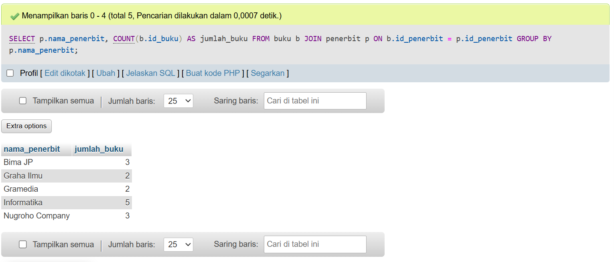

## 12. Detail Lengkap Buku
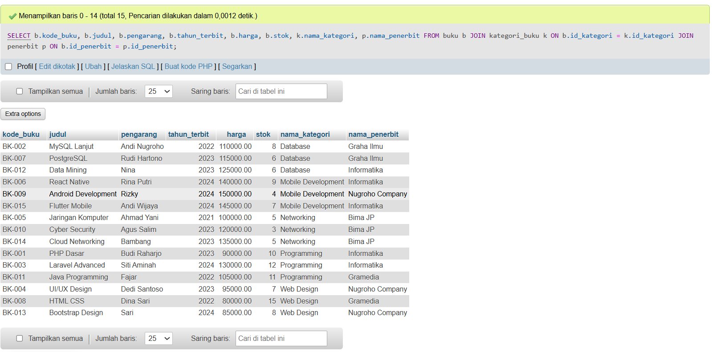

---

## 13. Proses Soft Delete
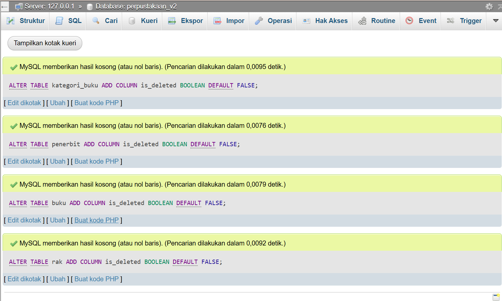

## 14. Hasil Soft Delete
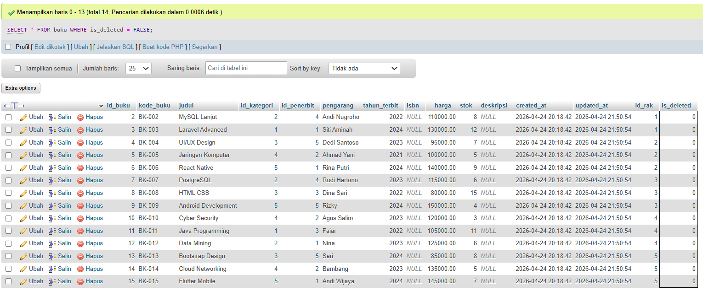

---

## 15. Stored Procedure
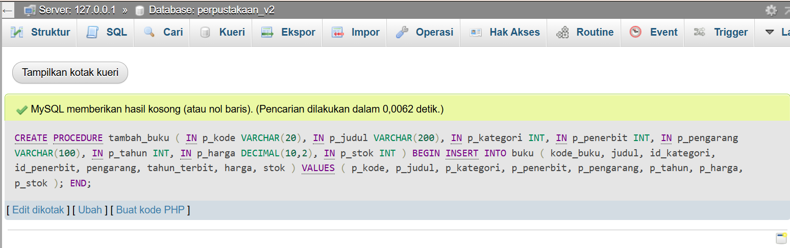

## 16. Proses Stored Procedure
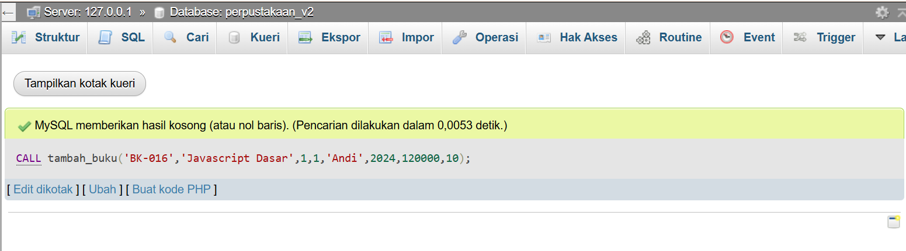

## 17. Hasil Stored Procedure
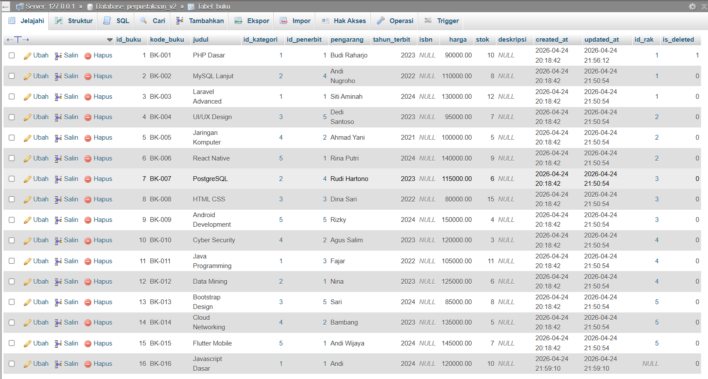

---

## 18. Entity Relationship Diagram (ERD)
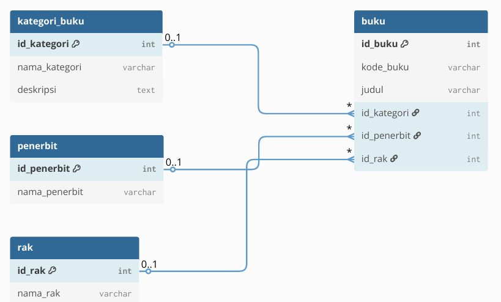
